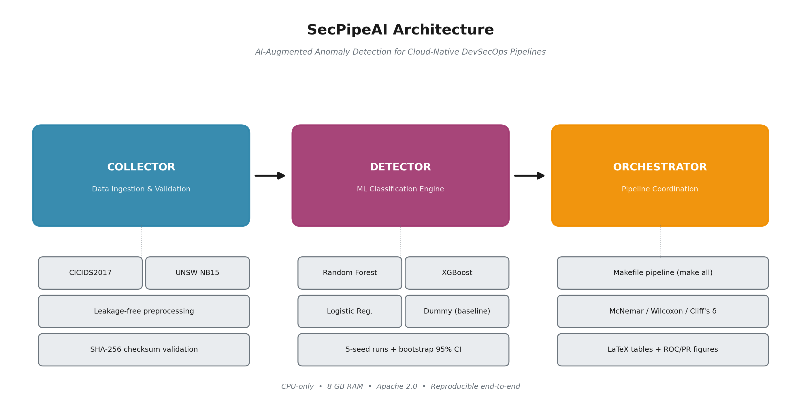

# SecPipeAI

**AI-Augmented Anomaly Detection and Threat Mitigation Framework for Cloud-Native DevSecOps Pipelines**

[](https://doi.org/10.5281/zenodo.18766118)
[](LICENSE)

## Overview

SecPipeAI is a reproducible machine-learning framework for network intrusion detection, designed to integrate into cloud-native DevSecOps pipelines. It benchmarks multiple classifiers on two widely used cybersecurity datasets (**CICIDS2017** and **UNSW-NB15**) with full statistical rigor including multi-seed evaluation, bootstrap confidence intervals, McNemar's test, and Cliff's delta effect sizes.

The framework is CPU-only and runs on commodity hardware (8 GB RAM), making it accessible for research and production deployment without GPU dependencies.

## Architecture



The framework is organized into three logical modules: a **Collector** for data ingestion, validation, and leakage-free preprocessing; a **Detector** that runs four ML classifiers (Dummy, Logistic Regression, Random Forest, XGBoost) with multi-seed evaluation; and an **Orchestrator** that coordinates the pipeline via a single Makefile and produces publication-ready statistical artifacts.

## Key Features

- **Leakage-free preprocessing**: imputers, scalers, and encoders fit on training data only
- **Multi-seed evaluation**: 5 independent seeds with bootstrap 95% confidence intervals
- **Statistical testing**: pairwise McNemar's test, Wilcoxon signed-rank, Cliff's delta
- **Four baseline classifiers**: Dummy, Logistic Regression, Random Forest, XGBoost
- **Publication-ready outputs**: LaTeX tables, ROC/PR curves, confusion matrices, bar charts
- **Full reproducibility**: Makefile pipeline, pinned dependencies, SHA-256 data checksums
- **CPU-only**: runs on 8 GB RAM without GPU

## Installation

### Prerequisites

- Python 3.10+
- 8 GB RAM minimum
- ~5 GB disk for raw datasets

### Setup

```bash
git clone https://github.com/nnolas27/SecPipeAI.git
cd SecPipeAI
make setup
source .venv/bin/activate
```

### Docker

```bash
docker build -t secpipeai .
docker run --rm -v $(pwd)/data:/app/data -v $(pwd)/outputs:/app/outputs secpipeai make all
```

## Quick Start

```bash
# 1. Download datasets (follow printed instructions)
make data

# 2. Run full pipeline
make all

# 3. Generate publication artifacts
make paper_artifacts
```

## Pipeline Commands

| Command | Description |
|---------|-------------|
| `make setup` | Create venv and install pinned dependencies |
| `make data` | Print download instructions and verify checksums |
| `make preprocess_cicids2017` | Preprocess CICIDS2017 dataset |
| `make preprocess_unsw_nb15` | Preprocess UNSW-NB15 dataset |
| `make train` | Train all models on both datasets |
| `make eval` | Generate metrics, confusion matrices, ROC plots |
| `make stats` | Pairwise McNemar tests (CSV + LaTeX) |
| `make seeds` | Multi-seed training runs (default: 5 seeds) |
| `make aggregate` | Aggregate seed results (mean, std, CI) |
| `make stats_advanced` | Bootstrap CI, Cliff's delta, Wilcoxon |
| `make paper_artifacts` | Generate all publication-ready artifacts |
| `make clean` | Remove outputs and processed data |

Scope to a single dataset: `make train DATASET=cicids2017`

## Datasets

| Dataset | Source | Samples | Features |
|---------|--------|---------|----------|
| [CICIDS2017](https://www.unb.ca/cic/datasets/ids-2017.html) | UNB CIC | 2.83M | 77 |
| [UNSW-NB15](https://research.unsw.edu.au/projects/unsw-nb15-dataset) | UNSW | 257K | 190 |

Raw data must be placed under `data/raw/` manually. Run `make data` for download instructions.

**Note:** Canonical download links for these datasets are intermittently unavailable. [Kaggle](https://www.kaggle.com/) and [Hugging Face](https://huggingface.co/) mirrors are reliable alternatives.

## Results Summary

### CICIDS2017

| Model | Macro-F1 (mean +/- std) | ROC-AUC |
|-------|-------------------------|---------|
| Dummy | 0.4454 +/- 0.0000 | - |
| Logistic Regression | 0.8808 +/- 0.0027 | - |
| Random Forest | 0.9967 +/- 0.0001 | - |
| **XGBoost** | **0.9981 +/- 0.0001** | **0.9999** |

Best model: **XGBoost** (Macro-F1 = 0.998, 95% CI [0.997, 0.998])

### UNSW-NB15

| Model | Macro-F1 (mean +/- std) | ROC-AUC |
|-------|-------------------------|---------|
| Dummy | 0.4050 +/- 0.0000 | - |
| Logistic Regression | 0.8684 +/- 0.0000 | - |
| **Random Forest** | **0.8959 +/- 0.0004** | **0.9862** |
| XGBoost | 0.8919 +/- 0.0003 | - |

Best model: **Random Forest** (Macro-F1 = 0.896, 95% CI [0.892, 0.898])

All pairwise comparisons (best vs. baseline) significant at p < 0.0001 (McNemar's test). Cliff's delta = 1.0 (large effect).

## Output Structure

```
outputs/
├── paper/
│   ├── figures/              # ROC, PR, confusion, bar charts
│   ├── final_results_table.{csv,tex}
│   ├── final_stats_table.{csv,tex}
│   ├── key_numbers.json      # Machine-readable results
│   └── README_paper_artifacts.md
├── models/<dataset>/         # Trained models (.joblib) + metadata
├── metrics/<dataset>/        # Per-model metrics, aggregate stats
└── figures/<dataset>/        # Per-dataset visualizations
```

## Reproducibility

All experiments are fully reproducible:

- `configs/experiment.yaml`: hyperparameters, dataset paths, seed configuration
- `configs/checksums.yaml`: SHA-256 checksums for raw data files
- `requirements.txt`: fully pinned Python dependencies
- `random_state=42` used throughout (overridden per-seed in multi-seed runs)
- Dockerfile provided for containerized reproduction

## Citation

If you use SecPipeAI in your research, please cite:

```bibtex
@software{singh2026secpipeai,
  author       = {Singh, Nihal},
  title        = {{SecPipeAI: AI-Augmented Anomaly Detection and Threat
                   Mitigation Framework for Cloud-Native DevSecOps Pipelines}},
  year         = {2026},
  publisher    = {Zenodo},
  doi          = {10.5281/zenodo.18766118},
  url          = {https://doi.org/10.5281/zenodo.18766118}
}
```

## License

This project is licensed under the Apache License 2.0. See [LICENSE](LICENSE) for details.

## Contact

**Nihal Singh**
- GitHub: [nnolas27](https://github.com/nnolas27)
